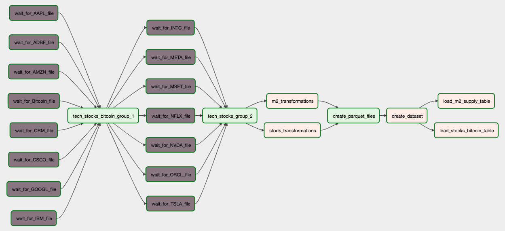
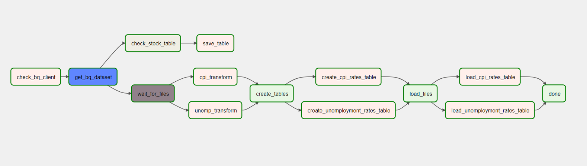
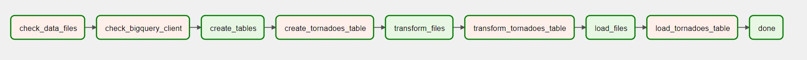
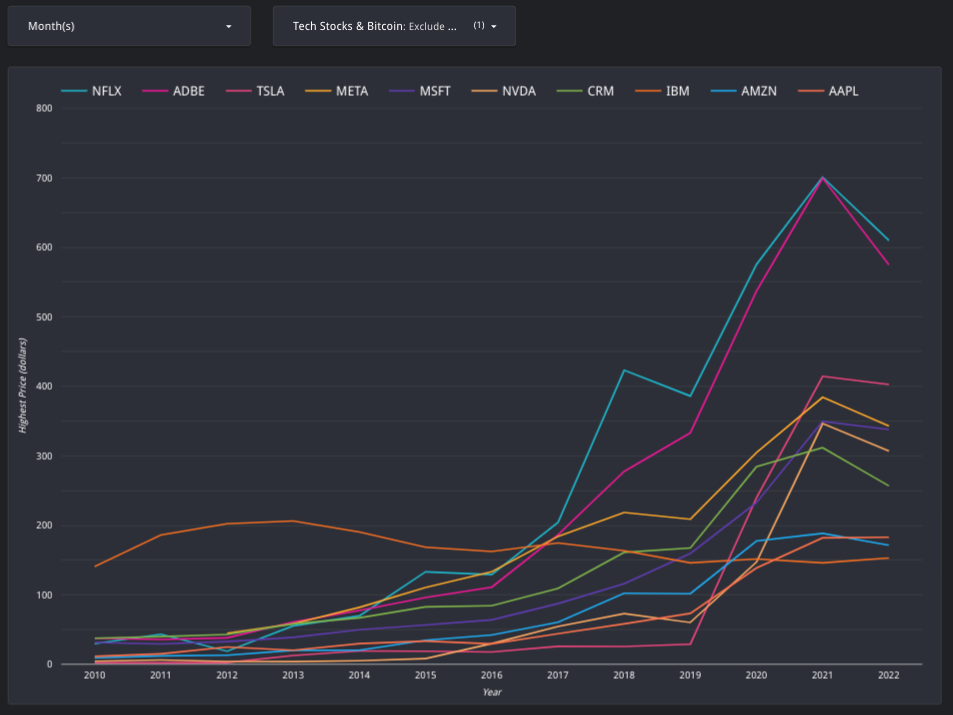
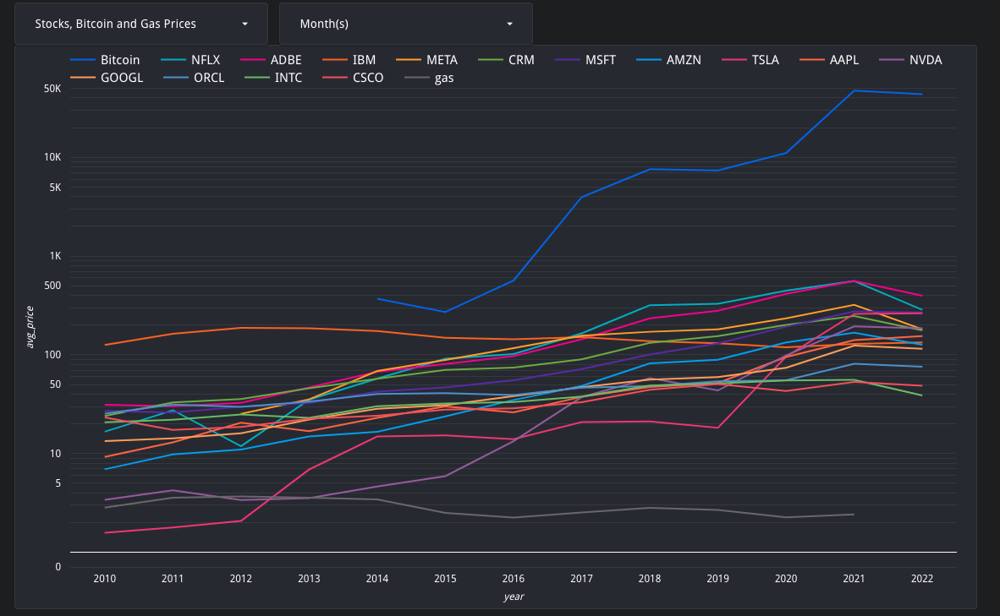
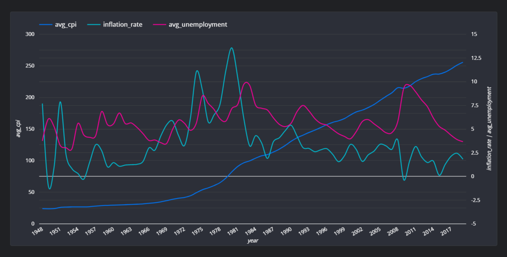
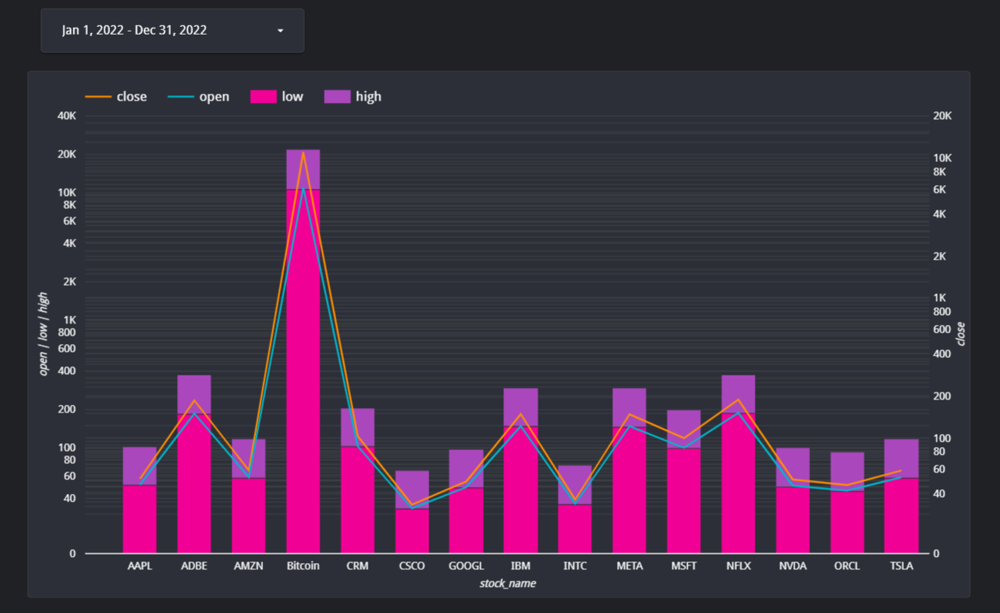
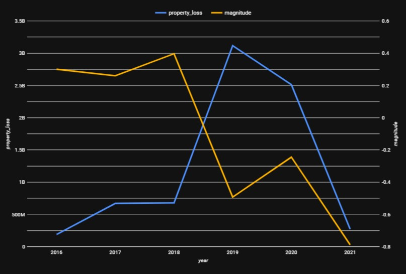

# What Impacts Tech Stock Valuations?

#### By [Ruben Giosa](https://www.linkedin.com/in/rubengiosa/), [Chloe (Yen Chi) Le](https://www.linkedin.com/in/chloeycl/), [Philip Kendal](https://www.linkedin.com/in/philiprobertovich)

#### This repo showcases working as a team to build an ETL pipeline and create visualizations using Python, SQL, Airflow, Pandas, BigQuery and Looker Studio.

<br>

## Technologies Used

* Python
* Jupyter
* Airflow
* BigQuery
* Looker Studio
* SQL
* Pandas
* Git
* Markdown
* `.gitignore`
* `requirements.txt`
  
</br>

## Datasets Used

1. [Big Tech Stock Prices](https://www.kaggle.com/datasets/evangower/big-tech-stock-prices)
2. [Bitcoin Prices Dataset](https://www.kaggle.com/datasets/yasserh/bitcoin-prices-dataset)
3. [M1, M2 and other Release Data, Monthly -in billions](https://www.federalreserve.gov/datadownload/Download.aspx?rel=H6&series=798e2796917702a5f8423426ba7e6b42&lastobs=&from=&to=&filetype=csv&label=include&layout=seriescolumn&type=package)
4. [U.S. Gasoline and Diesel Retail Prices 1995-2021](https://www.kaggle.com/datasets/mruanova/us-gasoline-and-diesel-retail-prices-19952021)
5. [US Monthly Unemployment Rate 1948](https://www.kaggle.com/datasets/tunguz/us-monthly-unemployment-rate-1948-present)
6. [U.S. Inflation Data](https://www.kaggle.com/datasets/varpit94/us-inflation-data-updated-till-may-2021)
7. [Tornadoes Dataset](https://www.kaggle.com/datasets/michaelbryantds/tornadoes)

</br>

## Description

[Ruben](https://www.linkedin.com/in/rubengiosa/) created a ETL pipeline leveraging Airflow to orchestrate profiling, cleaning, transformations, and loading of data into BigQuery on the below data: 
  * [Big Tech Stock Prices](https://www.kaggle.com/datasets/evangower/big-tech-stock-prices)
  * [Bitcoin Prices Dataset](https://www.kaggle.com/datasets/yasserh/bitcoin-prices-dataset)
  * [M1, M2 and other Release Data, Monthly -in billions](https://www.federalreserve.gov/datadownload/Download.aspx?rel=H6&series=798e2796917702a5f8423426ba7e6b42&lastobs=&from=&to=&filetype=csv&label=include&layout=seriescolumn&type=package)
  * [U.S. Gasoline and Diesel Retail Prices 1995-2021](https://www.kaggle.com/datasets/mruanova/us-gasoline-and-diesel-retail-prices-19952021)

The DAG is triggered once the data files are detected in the data directory using a `FileSensor`. Once the transformations are completed these are complied into three `Parquet` files. Upon completion, the dataset is created in BigQuery, where the the stocks and M2 Supply files are then loaded as tables. A `BigQueryTableExistenceSensor` is then used to ensure that the `m2_supply` table is loaded, which then kicks-off the final step of the loading of the `gas` table to BigQuery. Ruben also owned and authored the `README.md`. Below is the DAG of the above pipeline:



<br>

[Chloe](https://www.linkedin.com/in/chloeycl/) worked on profiling, cleaning and transformations for the [US Monthly Unemployment Rate 1948](https://www.kaggle.com/datasets/tunguz/us-monthly-unemployment-rate-1948-present) and [U.S. Inflation Data](https://www.kaggle.com/datasets/varpit94/us-inflation-data-updated-till-may-2021). She created an ETL pipeline leveraging Airflow that checked BigQuery for the existence of the `tech_stocks_world_events` dataset in BigQuery using `BigQueryGetDatasetOperator`, upon that check it waits for the two files ([US Monthly Unemployment Rate 1948](https://www.kaggle.com/datasets/tunguz/us-monthly-unemployment-rate-1948-present) and [U.S. Inflation Data](https://www.kaggle.com/datasets/varpit94/us-inflation-data-updated-till-may-2021)) to get loaded into the local directory to then kick-off

1. Transformations
2. Creation of tables
3. Loading of tables to BigQuery. 

Beside checking the existence of the `tech_stocks_world_events`, `BigQueryTableExistenceSensor` is also used to detect the creation of `stocks` table then save it to local file. Below is the DAG of the above pipeline:




<br>

[Phil](https://www.linkedin.com/in/philiprobertovich) dealt with handling datasets about natural disasters, specifically tornadoes within the US. Firstly, he profiled and built the pipeline within a Jupyter Notebook. Then, he refactored all that into a series of modules that Airflow could work with. The bulk of the pipeline is housed within the `phil_utils` directory, which essentially is a local package that can be used by the main DAG file to import all the necessary ETL tools and keeps things fairly modular. The `utils.py` is where important objects and variables such as logger, and the pathway to the data directory are constructed in order to be used by the different modules. The configuration file specific to Phil's pipeline is also loaded within this module so it can also be imported into the other files. The `table_definitions.py` file creates the tornadoes table and defines the schema. The `transformation.py` file constructs all the necessary transformations that will be applied to the table. The `table_loaders.py` file loads the table to BigQuery. The `phil_work.py` file is where the DAG for this pipeline is created. It imports all the methods from the `phil_utils` packaged mentioned before so that they can be assigned to tasks. Below is the DAG and it's various tasks: 



<br>

## Data Visualizations:
Once the datasets were cleaned and consolidated, the team created data visualizations and analysis (using Looker Studio).

Below is a line graph that was put together by [Ruben](https://www.linkedin.com/in/rubengiosa/) that allows a user to look at the highest tech stock and Bitcoin prices by year (click on image of chart to use dashboard), which leverages the data from the `stocks` table:

<br>

[](https://lookerstudio.google.com/reporting/5d9a4269-f35d-4b46-a6b3-54bcbbb990a1)

The chart is dynamic in that it allows users to filter for specific months of each year and specific stock/bitcoin combinations.

<br>

Below is a combo chart by [Ruben](https://www.linkedin.com/in/rubengiosa/) that shows the average tech stock and bitcoin price compared against average annual [M2 Money supply](https://en.wikipedia.org/wiki/Money_supply#:~:text=M2%20is%20a%20broader%20classification,large%20and%20long%2Dterm%20deposits.) (click on image of chart to use dashboard):

<br>

[](https://lookerstudio.google.com/reporting/5d9a4269-f35d-4b46-a6b3-54bcbbb990a1)

The chart leverages different scales for the left and right y-axis to better show the correlation between stock/bitcoin prices and M2 money supply over time. The chart is dynamic in that it allows users to filter for months and specific stocks and/or bitcoin. Overall it shows the correlation that as additional money is created it leads to the increase in valuation prices of assets such as stocks and bitcoin. For the above visual a `Custom Query` was leveraged to pull it from BigQuery to combined the datasets for use in Looker:


```sql
with stocks as (
  Select CONCAT(year, month) as ym, year, month, stock_name, (avg(open) + avg(high) + avg(low) + avg(close))/4 as avg_price
  from `team-week-3.tech_stocks_world_events.stocks`
  Group BY ym, stock_name, year, month),

m2 as (
  Select CONCAT(year, month) as ym, m2_supply
  from `team-week-3.tech_stocks_world_events.m2_supply`
  Group BY ym, m2_supply),

combined as (SELECT stocks.ym, stocks.year, stocks.month, stocks.stock_name, stocks.avg_price, m2.m2_supply
from stocks
INNER JOIN m2
ON stocks.ym = m2.ym)

SELECT year, month, stock_name, avg_price, m2_supply
FROM combined;
```

<br>

Below is a line graph by [Ruben](https://www.linkedin.com/in/rubengiosa/) that shows the average tech stock and bitcoin price compared against average annual petroleum gas price. (click on image of chart to use dashboard):

<br>

[](https://lookerstudio.google.com/reporting/d908aa95-fbc2-49df-8fbc-003aae1fd5df)

The chart leverages the log scale to better show the correlation between stock/bitcoin prices and gas prices over time. The chart is dynamic in that it allows users to filter for months and specific stocks and/or bitcoin. Overall it shows that there is not a immediate correlation between tech stocks and Bitcoin with gas prices. Yet it does not rule out that there are broader impacts to stocks resulting from gas prices based on impacts to discretionary spending.

For the above visual a `Custom Query` was leveraged to pull it from BigQuery to combined the datasets for use in Looker:
```sql
with stocks as (
  Select CONCAT(year, month) as ym, year, month, stock_name, (avg(open) + avg(high) + avg(low) + avg(close))/4 as avg_price
  from `team-week-3.tech_stocks_world_events.stocks`
  Group BY ym, stock_name, year, month),

gas as (
  Select year, month, 'gas' as stock_name, avg(all_grade_prices) as avg_price
  from `team-week-3.tech_stocks_world_events.gas_prices`
  Group BY year, month),

combined as (SELECT stocks.year, stocks.month, stocks.stock_name, stocks.avg_price FROM stocks
UNION ALL
SELECT gas.year, gas.month, gas.stock_name, gas.avg_price FROM gas)

SELECT year, month, stock_name, avg_price
FROM combined;
```


<br>

[Chloe](https://www.linkedin.com/in/chloeycl/) creates a line chart that shows the correlation among unemployment, CPI (Consumer Price Index), and inflation rates over the year. (click on image of chart to use dashboard):

<br>

[](https://lookerstudio.google.com/s/r66wu-F_ZH4)

<br>

The chart information is generated by the `Custom Query` below:  
```sql
WITH
-- calculate difference in cpi between current year and previous year
inflation_v1 as (
  SELECT 
  year,
  avg(cpi) avg_cpi,
  LAG(avg(cpi)) OVER (ORDER BY year) as previous_year,
  avg(cpi) - LAG(avg(cpi)) OVER (ORDER BY year) as difference_previous_year
  FROM `tech_stocks_world_events.cpi_rates`
  GROUP BY year
),

--calculate inflation
inflation as (
  SELECT year, avg_cpi, previous_year, difference_previous_year,(difference_previous_year / previous_year) * 100 inflation_rate
  FROM inflation_v1
  ORDER BY 1
),

-- calculate unemployment rate per year
avg_unemp_per_year as (
  SELECT year,((jan + feb+ mar+ apr+ may+ jun+ jul+ aug+ sep+ oct+ nov+ dec)/12) as avg_unemployment
  FROM `tech_stocks_world_events.unemployment_rates`
)

--join inflation and avg_unemp_per_year
  SELECT i.year, i.avg_cpi, i.previous_year, i.difference_previous_year, i.inflation_rate, u.avg_unemployment
  FROM inflation i
  INNER JOIN avg_unemp_per_year u
  ON i.year = u.year
  ORDER BY year
```
<br>

She also creates a stacked combo chart that shows the average of open, close, high and low of Tech companies' and Bitcoin stock in 2022. (click on image of chart to use dashboard):

[](https://lookerstudio.google.com/s/r66wu-F_ZH4)

<br>

Below is a line chart created by [Phil](https://www.linkedin.com/in/philiprobertovich) that compares the average magnitude of tornadoes against the total sum of property losses through the years 2016-2021:

[](https://lookerstudio.google.com/reporting/04fcb6ef-1e93-48fc-bc22-0284e3970648)

<br>

Overall, the team was able to limit the amount of merge conflicts by working on independent notebooks and assigning different tasks (e.g. Each focused on constructing specific DAGs and python files, etc.). One challenge we came across was setting up a BigQuery project and granting access to each user, this was a great learning experience for the team as we set up Service Accounts with authorization keys for each user.

## Setup/Installation Requirements

* Go to https://github.com/philiprobertovich/team-week3.git to find the specific repository for this website.
* Then open your terminal. I recommend going to your Desktop directory:
    ```bash
    cd Desktop
    ```
* Then clone the repository by inputting: 
  ```bash
  git clone https://github.com/philiprobertovich/team-week3.git
  ```
* Go to the new directory or open the directory folder on your desktop:
  ```bash
  cd team-week3
  ```
* Once in the directory you will need to set up a virtual environment in your terminal:
  ```bash
  python3.7 -m venv venv
  ```
* Then activate the environment:
  ```bash
  source venv/bin/activate
  ```
* Install the necessary items with requirements.txt:
  ```bash
    pip install -r requirements.txt
  ```
* Download the necessary csv files listed in the Datasets Used section
* With your virtual environment now enabled with proper requirements, open the directory:
  ```bash
  code .
  ```
* Upon launch please update the Google Cloud client and project details to configure it to load to your project

* Once VS Code is open, then run the setup file:
  ```bash
  ./setup.sh
  ```

    The contents of the `setup.sh` include the below to install:

    1. Relevant version of python
    2. Create virtual env
    3. Installing Airflow in virtual env
    4. Requirements.txt

    ```bash
    #/bin/bash
    # this script will setup the environment and install all necessary components 

    # install/upgrade virtualenv
    python3.7 -m pip install --upgrade virtualenv

    # create and run a python3.7 virtual env
    python3.7 -m venv venv
    source venv/bin/activate
    # install/upgrade pip
    python3.7 -m pip install --upgrade pip setuptools wheel

    # install Airflow in the virtual env
    AIRFLOW_VERSION=2.3.2
    PYTHON_VERSION=3.7
    CONSTRAINT_URL="https://raw.githubusercontent.com/apache/airflow/constraints-${AIRFLOW_VERSION}/constraints-${PYTHON_VERSION}.txt"
    pip install "apache-airflow[async,postgres,google]==${AIRFLOW_VERSION}" --constraint "${CONSTRAINT_URL}"

    # pip install pypi packages
    pip install -r requirements.txt
    ```

* Then run the airflow setup file:

  ```bash
  ./airflow_setup.sh
  ```
    
    The contents of the `airflow_setup.sh` include the below to:

    1. Creating ./logs and ./plugins directories in the dsa-airflow directory 
    2. Download the `docker_compose.yaml` 
    3. Create the .env 
    4. Initialize airflow
    
```bash
    #!/bin/bash
    # Move into the dsa-airflow directory and make subdirs
    cd dsa-airflow

    # download the docker-compose.yaml and set the .env
    curl -LfO 'https://airflow.apache.org/docs/apache-airflow/stable/docker-compose.yaml'
    echo "AIRFLOW_UID=$(id -u)\nAIRFLOW_GID=0" > .env


    # initialize airflow 
    docker-compose up airflow-init
```

* Once airflow has been initialized, use the below command line tool that allows you to initialize the rest of the Docker containers:
        ```bash
        docker-compose up
        ```

* You will need to create a file connection for the `data/` folder. To do so go to the airflow GUI and click Admin -> Connections and then create a new connection with the below config and click save:

    


* You will need to create a cloud connection for the `BigQueryTableExistenceSensor` folder to work:
    * Connection Id: google-cloud-default
    * Connection Type: Google BigQuery

* Once this is all setup, in the Airflow GUI 1) enable your DAG and 2) trigger it to run. From there go to your VS Code and run the below command from inside the data directory:

    ```bash
    ./get_data.sh
    ```
This will download the CSV file to your local filesystem in the data folder, which will trigger the file sensor and start the DAG.

* Once setups have been completed, you will want to be using the below commands to manage airflow and docker:
    
    1. In order to shut down hit `^Ctrl C` to stop Airflow on the local host and then run the below to stop the containers and remove old volumes:
        ```bash
        docker-compose down --volumes --remove-orphans 
        ```
    2. Use the below command line tool if you want to re-initialize the rest of the Docker containers:
        ```bash
        docker-compose up
        ```

</br>

## Known Bugs

* No known bugs

<br>

## License

MIT License

Copyright (c) 2022 Ruben Giosa, Philip Kendal, Chloe (Yen Chi) Le

Permission is hereby granted, free of charge, to any person obtaining a copy of this software and associated documentation files (the "Software"), to deal in the Software without restriction, including without limitation the rights to use, copy, modify, merge, publish, distribute, sublicense, and/or sell copies of the Software, and to permit persons to whom the Software is furnished to do so, subject to the following conditions:

The above copyright notice and this permission notice shall be included in all copies or substantial portions of the Software.

THE SOFTWARE IS PROVIDED "AS IS", WITHOUT WARRANTY OF ANY KIND, EXPRESS OR IMPLIED, INCLUDING BUT NOT LIMITED TO THE WARRANTIES OF MERCHANTABILITY, FITNESS FOR A PARTICULAR PURPOSE AND NONINFRINGEMENT. IN NO EVENT SHALL THE AUTHORS OR COPYRIGHT HOLDERS BE LIABLE FOR ANY CLAIM, DAMAGES OR OTHER LIABILITY, WHETHER IN AN ACTION OF CONTRACT, TORT OR OTHERWISE, ARISING FROM, OUT OF OR IN CONNECTION WITH THE SOFTWARE OR THE USE OR OTHER DEALINGS IN THE SOFTWARE.

</br>
